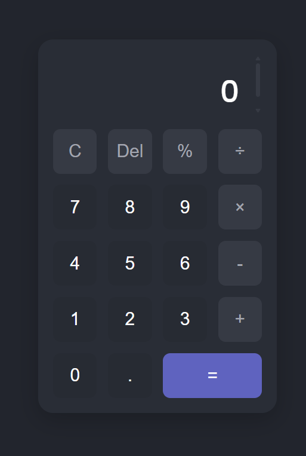

# Sleek Web Calculator 🧮  

A responsive and user-friendly calculator built with **vanilla JavaScript, HTML, and CSS**.  
This project showcases **core front-end development skills**, focusing on:  
- Clean UI  
- Safe calculation logic  
- Smooth user experience  
- Zero external libraries  

---

## ✨ Live Demo  
🔗 [Try the Calculator Here](https://Ryker009.github.io/Calculator/)  

---



---

## 🚀 Features  
- ➕ **All Standard Operations** – Addition, subtraction, multiplication, division, percentage, and decimals.  
- 🔒 **Safe Calculation Logic** – Avoids `eval()` for security and robustness.  
- ⌨️ **Full Keyboard Support** – Perform calculations directly from your keyboard.  
- 🌙 **Modern Dark-Mode UI** – Smooth animations, clear visual feedback, and aesthetic styling.  
- ⚠️ **Robust Error Handling** – Handles invalid expressions (e.g., division by zero shows `"Error"`).  
- 📱 **Fully Responsive** – Adapts perfectly to desktops, tablets, and mobile screens.  
- ⚡ **Lightweight & Fast** – Pure vanilla JavaScript with zero dependencies.  

---

## 🛠️ Tech Stack  
- **HTML5** – Semantic structure for calculator layout and display  
- **CSS3** – Dark-mode styling, button animations, and responsive grid system  
- **JavaScript (ES6)** – DOM manipulation, event handling, and safe calculation engine  

---

## 🏁 Getting Started  

Follow these steps to run the calculator locally:  

### 1️⃣ Clone the repository  
```bash
git clone https://github.com/Ryker009/Calculator.git
